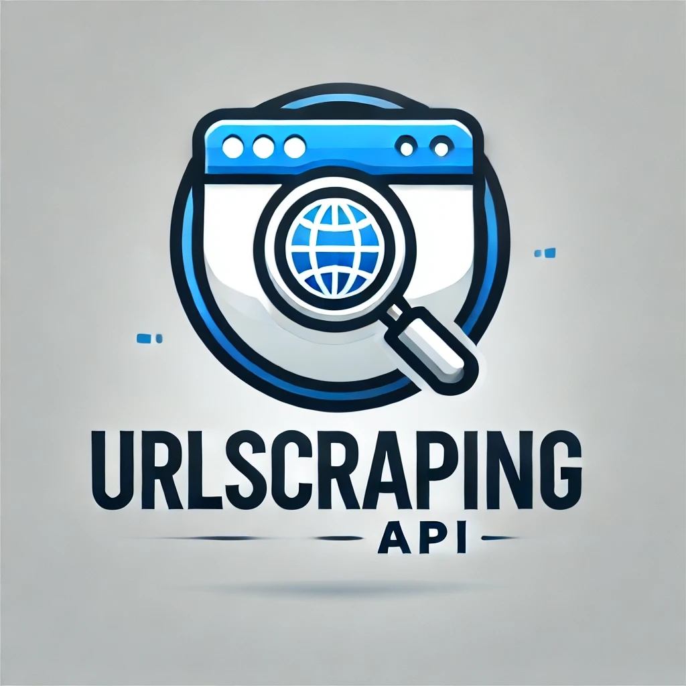

# UrlScrapingApi

<p align="center">
  
</p>

This project is a Symfony-based web application that utilizes various components such as Flow, API Platform, and OpenAI integration. It is designed to scrape URLs, summarize their content, and generate relevant tags using OpenAI's GPT model.

## Features

- URL scraping and content summarization
- Tag generation using OpenAI's GPT model
- API Platform integration for easy API management (https://api-platform.com)
- Symfony framework for robust application structure
- Flow integration for enhanced workflow automation (https://flow.darkwood.com)

## Requirements

- PHP 8.2 or higher
- Composer

## Installation

1. **Clone the repository:**

   ```bash
   git clone <repository-url>
   cd <repository-directory>
   ```

2. **Install dependencies:**

   Make sure you have Composer installed, then run:

   ```bash
   composer install
   ```

3. **Set up environment variables:**

   Copy the `.env` file to `.env.local` and configure your environment variables, especially the `DATABASE_URL` and `OPENAI_API_KEY`.

4. **Database setup:**

   If using Docker, ensure Docker is running and execute:

   ```bash
   docker-compose up -d
   ```

   Otherwise, set up your database manually and update the `DATABASE_URL` in your `.env.local`.

## Usage

1. **Start the Symfony server:**

   ```bash
   symfony server:start
   ```

2. **Access the API:**

   The API is accessible at `http://localhost:8000/api`. You can use tools like Postman or curl to interact with the API.

3. **Scrape a URL:**

   Send a POST request to `/api/scrape-url` with a JSON body containing the URL you want to scrape:

   ```json
   {
     "url": "https://example.com"
   }
   ```

   The response will include a summary and tags for the provided URL.

## Contributing

Contributions are welcome! Please fork the repository and submit a pull request for any improvements or bug fixes.

## License

This project is licensed under the MIT License. See the [LICENSE](./LICENSE) file for more details.

